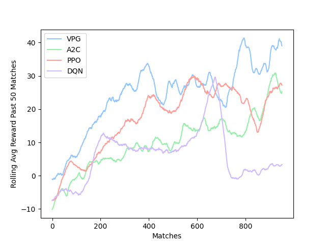

## PongRL

- Vanilla Policy Gradients ('vpg')
- Advantage Actor-Critic ('a2c')
- Proximal Policy Optimization ('ppo')
- Deep Q Network ('dqn')


##### Algorithm Options Shown Above
```
python run.py train <algo> # train one ai algorithm
python run.py train_all # train all - takes some time for learning to get going
python run.py play_vs <algo> # play vs an ai
python run.py watch <algo> <algo> # two trained ais against each other
```

<p> Graph from my training. <br>
  The environment is set up such that the maximum reward per match is around 60 because allowing too many consecutive hits would drastically increase training time.</p>
  


###### Ankit Malhotra
